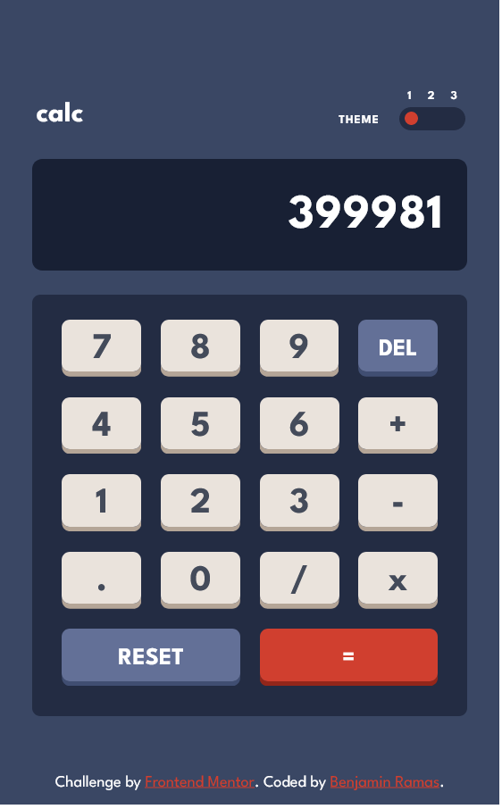

# Frontend Mentor - Calculator app solution

This is a solution to the [Calculator app challenge on Frontend Mentor](https://www.frontendmentor.io/challenges/calculator-app-9lteq5N29). Frontend Mentor challenges help you improve your coding skills by building realistic projects. 

## Table of contents

- [Overview](#overview)
  - [The challenge](#the-challenge)
  - [Screenshot](#screenshot)
  - [Links](#links)
- [My process](#my-process)
  - [Built with](#built-with)
  - [What I learned](#what-i-learned)
  - [Continued development](#continued-development)
  - [Useful resources](#useful-resources)
- [Author](#author)

## Overview

### The challenge

Users should be able to:

- See the size of the elements adjust based on their device's screen size
- Perform mathmatical operations like addition, subtraction, multiplication, and division
- Adjust the color theme based on their preference
- **Bonus**: Have their initial theme preference checked using `prefers-color-scheme` and have any additional changes saved in the browser

### Screenshot

## My process

1. I first started by recreating the general layout so even without styling the placement of the elements should closely align with what I am trying to achieve.

2. I then start creating styles in css and scss to better match the intende design

3. I then sectioned off the colours into their own seperate stylesheets so I could easily swap between them

4. I added javascript functionailty to theme changing. And replaced the previous button I used with an input slider.

5. I then added calculation functionality with the calculator being fully operational.

### Built with

- Semantic HTML5 markup
- CSS custom properties
- Flexbox
- Sass

### What I learned

I learned how to utilize the slider tool.

### Continued development

I am having a lot of difficulty with the calculator display and currently when the display text is too large it overflows to the left and a scroll bar appears however I wish for it to overflow to the right.

## Author

- Github - [Benjamin Ramas](https://github.com/Benjamin-Ramas)
- Frontend Mentor - [@Benjamin-Ramas](https://www.frontendmentor.io/profile/Benjamin-Ramas)

